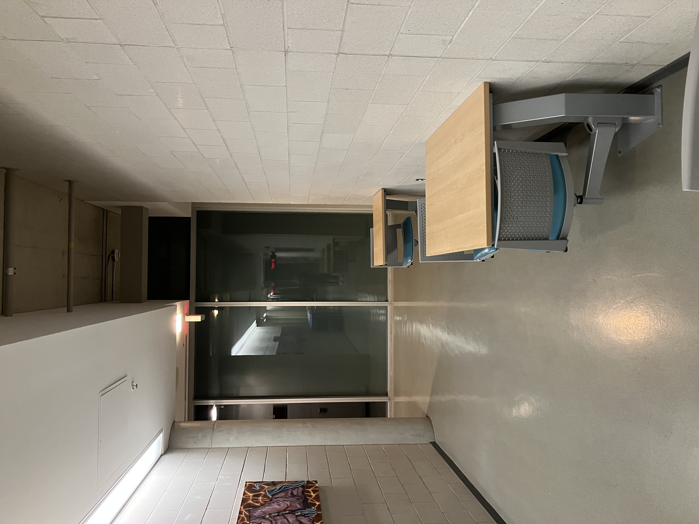
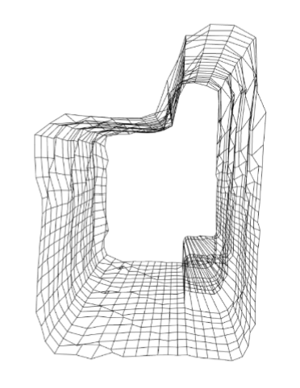

# Embedded Spatial Mapping System (Time-of-Flight)

## Overview
This project is an embedded spatial mapping system that uses a Time-of-Flight (ToF) sensor to generate a 3D representation of the surrounding environment.

The system integrates a microcontroller, stepper motors, and a ToF sensor to perform automated scanning. Distance measurements are collected in real time, transmitted to a PC via UART, and processed using Python to generate a 3D point cloud visualization.

The physical platform was implemented using a custom-built vehicle (LEGO-based chassis) with motorized scanning and forward motion.

---

## Full Documentation

For detailed system design, hardware setup, and implementation details, see the full report:

📄 [Project Report (PDF)](docs/tof-spatial-mapping-documentation.pdf)

---

## System Architecture

The system consists of:

- **VL53L1X ToF Sensor** → distance measurement
- **Stepper Motor (Scan Axis)** → 360° vertical scanning (y–z plane)
- **Stepper Motor (Drive Axis)** → forward motion (x-axis)
- **MSP432E401Y Microcontroller** → control + data acquisition
- **UART Communication** → data transfer to PC
- **Python Processing Pipeline** → data parsing, conversion, visualization

---

## Key Features

- 360° scanning using a motorized ToF sensor
- Multi-slice environment mapping (3D reconstruction)
- Interrupt-driven data acquisition
- I2C communication with ToF sensor (100 kHz)
- UART communication at 115200 bps
- Real-time data parsing using PySerial
- 3D point cloud generation using NumPy + Open3D

---

## Hardware

- MSP432E401Y Microcontroller
- VL53L1X Time-of-Flight Sensor
- 28BYJ-48 Stepper Motors + ULN2003 Drivers
- Custom LEGO-based vehicle platform

---

## Software

### Firmware (Microcontroller)
- Language: C
- Handles:
  - Sensor communication (I2C)
  - Motor control
  - Data acquisition
  - UART transmission

### PC-Side Processing
- Language: Python
- Libraries:
  - PySerial
  - NumPy
  - Open3D

---

## Data Processing Pipeline

1. Sensor collects distance measurements
2. Data transmitted via UART with START/END flags
3. Python script parses incoming data
4. Distances converted to Cartesian coordinates:
   - y = d · sin(θ)
   - z = d · cos(θ) + h
5. Multiple scans combined into 3D point cloud
6. Visualization generated using Open3D

---

## Demo Results

  
  

  Real Environment vs Generated 3D Map

