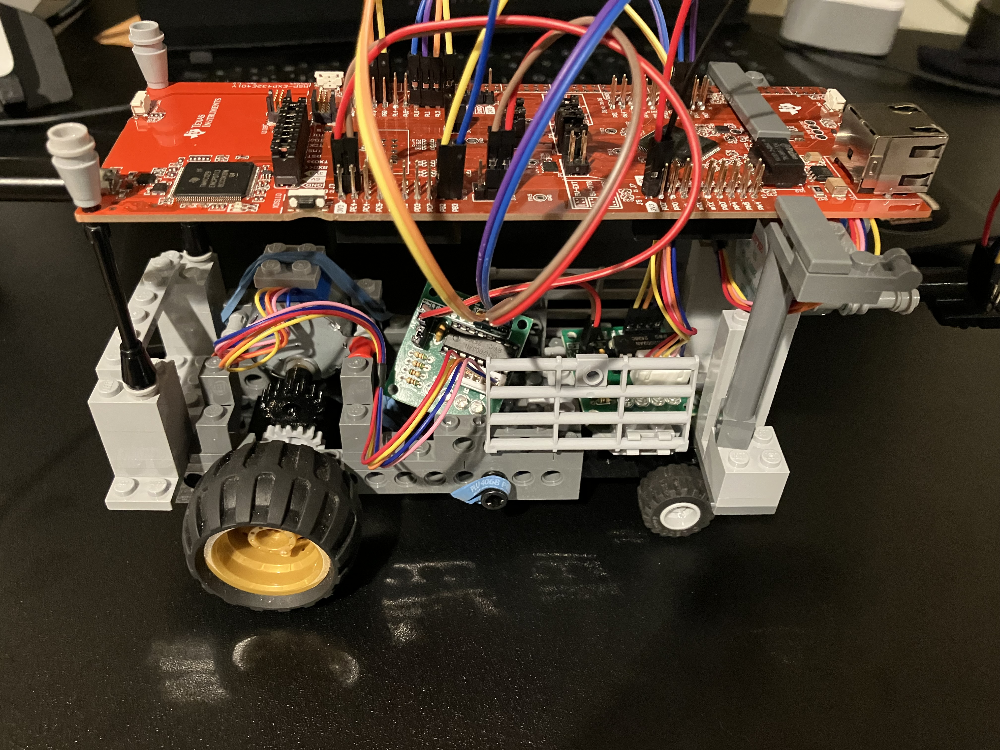
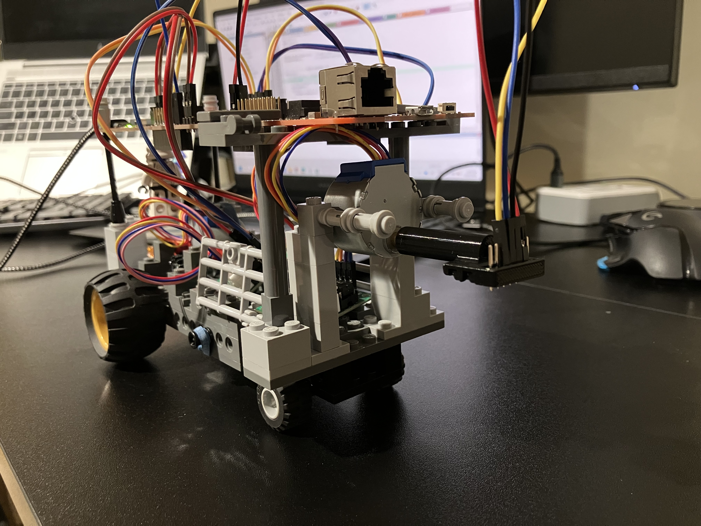

# Embedded Spatial Mapping System (Time-of-Flight)

## Overview
This project is an embedded spatial mapping system that uses a Time-of-Flight (ToF) sensor to generate a 3D representation of the surrounding environment.

The system integrates a microcontroller, stepper motors, and a ToF sensor to perform automated scanning. Distance measurements are collected in real time, transmitted to a PC via UART, and processed using Python to generate a 3D point cloud visualization.

The physical platform was implemented using a custom LEGO-based vehicle with motorized scanning and forward motion.

---

## Full Documentation

For detailed system design, hardware setup, and implementation details:

📄 [ToF-Documentation (PDF)](docs/tof-spatial-mapping-documentation.pdf)

---

## System Architecture

- **VL53L1X ToF Sensor** → distance measurement  
- **Stepper Motor (Scan Axis)** → 360° vertical scanning (y–z plane)  
- **Stepper Motor (Drive Axis)** → forward motion (x-axis)  
- **MSP432E401Y Microcontroller** → control and data acquisition  
- **UART Communication** → data transfer to PC  
- **Python Processing Pipeline** → parsing, coordinate conversion, visualization  

---

## Hardware

- MSP432E401Y Microcontroller  
- VL53L1X Time-of-Flight Sensor  
- 28BYJ-48 Stepper Motors with ULN2003 Drivers  
- Custom LEGO-based mobile platform  

---

## Software

### Firmware (Microcontroller)
- Language: C  
- Handles sensor communication, motor control, data acquisition, and UART transmission  

### PC-Side Processing
- Language: Python  
- Libraries: PySerial, NumPy, Open3D  

---

## Data Processing Pipeline

1. Collect distance measurements from the ToF sensor  
2. Transmit data via UART with start/end markers  
3. Parse incoming data in Python  
4. Convert polar measurements to Cartesian coordinates  
5. Combine multiple scans into a 3D point cloud  
6. Visualize using Open3D  

---

## Hardware Platform

  
  

  Custom LEGO-based vehicle

---

## Demo Results

  
  

  Real Environment vs Generated 3D Map

